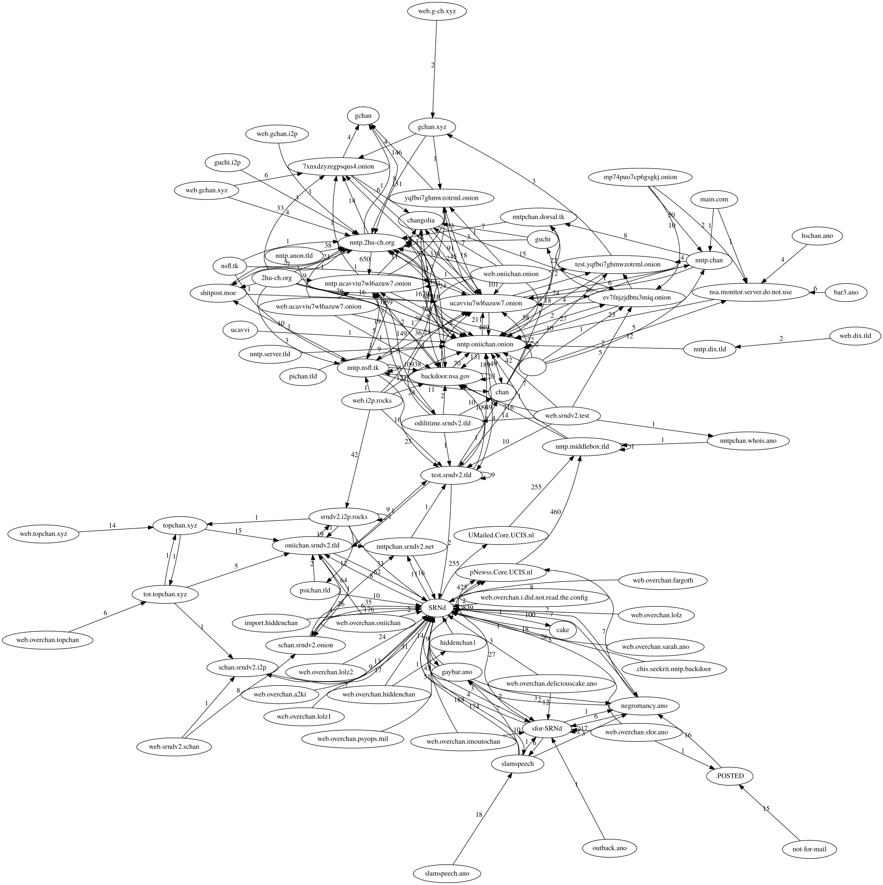

**NNTPChan** (previously known as overchan) is a decentralized imageboard that uses the [NNTP protocol](https://en.wikipedia.org/wiki/Network_News_Transfer_Protocol) (network-news transfer protocol) to synchronize content between many different servers. It utilizes cryptographically signed posts to perform optional/opt-in decentralized moderation.

## Getting started

[This](doc) is a step-by-step guide for getting up-and-running with NNTPChan as well as documentation for developers who want to either work on NNTPChan directly or use NNTPChan in their aplications with the API.

TL;DR edition:

    $ sudo apt update
    $ sudo apt install --no-install-recommends install imagemagick ffmpeg sox build-essential git ca-certificates postgresql postgresql-client golang
    $ git clone https://github.com/majestrate/nntpchan
    $ cd nntpchan
    $ make
    $ SRND_INSTALLER=0 ./srndv2 setup 

## Bugs and issues

*PLEASE* report any bugs you find while building, setting-up or using NNTPChan on the [GitHub issue tracker](https://github.com/majestrate/nntpchan/issues), the [issue tracker on tor](http://git.psii2pdloxelodts.onion/psi/nntpchan/), the [issue tracker on i2p](http://git.psi.i2p/psi/nntpchan/) or on the [GitGud issue tracker](https://gitgud.io/jeff/nntpchan/issues) so that the probelms can be resolved or discussed.

## Clients

NNTP (confirmed working):

* Thunderbird

Web:

* [Yukko](https://github.com/faissaloo/Yukko): ncurses based nntpchan web ui reader

## Support

Need help? Join us on IRC.

1. [freenode: #nntpchan](https://webchat.freenode.net/?channels=#nntpchan)
2. [rizon: #nntpchan](https://qchat.rizon.net/?channels=#nntpchan) - Most active

## History

* started in mid 2013 on anonet

This is a graph of the post flow of the `overchan.test` newsgroup over 4 years, quite a big network.

(thnx anon who made this btw)

[source code for map generation](https://github.com/nilesr/nntpchan-mapper)

## Donations

Like this project? Why not help by funding it? This address pays for the server that runs `2hu-ch.org`

Bitcoin: 15yuMzuueV8y5vPQQ39ZqQVz5Ey98DNrjE

Monero: 46thSVXSPNhJkCgUsFD9WuCjW4K41DAHGL9khni2VEqmZZhfEZVvcukCp357rfhngZdviZMaeNdj5CLqhLyeK2qZRBCyL7Q

## Acknowledgements

* [Deavmi](https://deavmi.carteronline.net/) - Making the documentation beautiful.
