Configure Mozilla Thunderbird newsreader
========================================

This is a guide on how to setup Mozilla Thunderbird so that you may read and post articles from and an NNTPChan node.

The first thing to know is that by default, nntp binds to 127.0.0.1, which means you won't be able to connect to it.

You can change your bind= line to bind=0.0.0.0:1199, but if you don't have a firewall blocking public access to this port, anyone can connect.

The recommended way to connect is probably either to configure your firewall to only allow your IP address to connect on port 1199, or use an ssh tunnel. To use an ssh tunnel, you would run something like this: `ssh -L 1199:127.0.0.1:1199 your.servers.ip.here`, then log in like a normal ssh connection. Leave that connection running in the background, and you can point thunderbird to the server IP address 127.0.0.1 and it will work. If you use an ssh tunnel, you can leave your bind= as the relatively-safer 127.0.0.1:1199

In my example, my computer is on a VPN that is run by the server. The vpn's firewall is configured to allow incoming connections on port 1199 to anything on the vpn (10.8.0.0/16), but not from any public IP. This is also relatively very safe (assuming your vpn is properly secured)

The first thing to do is to add a new account. For the most part here you can just follow the pictures

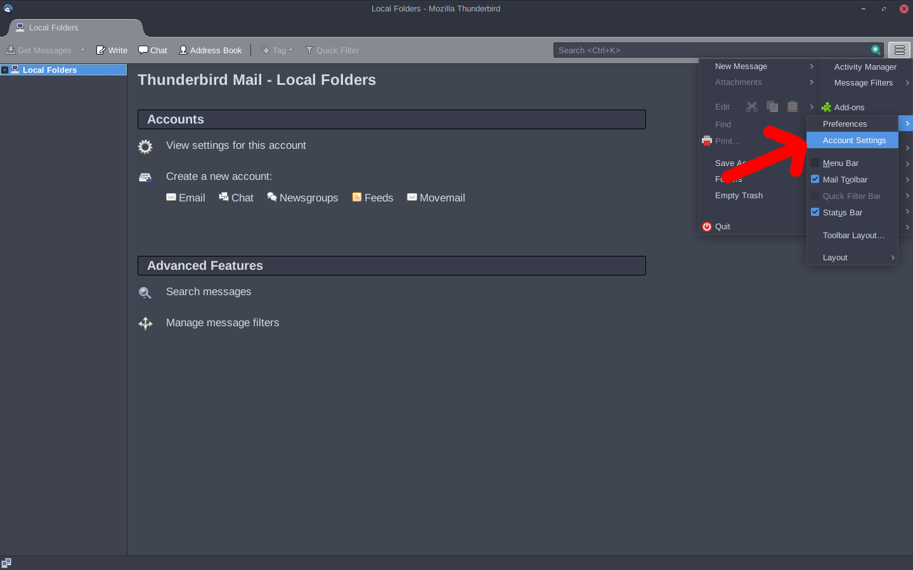

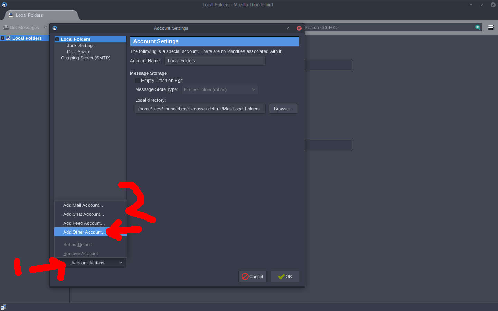

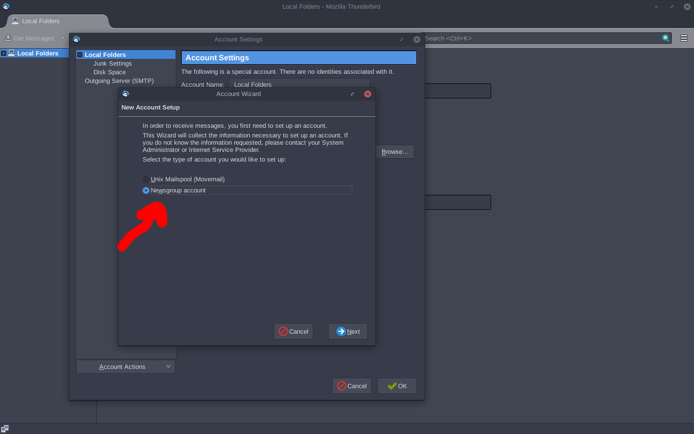

Whatever you put in the "Your Name" field here is what will be displayed in green on the website. It's best to set it to Anonymous so you don't look like a tripfag

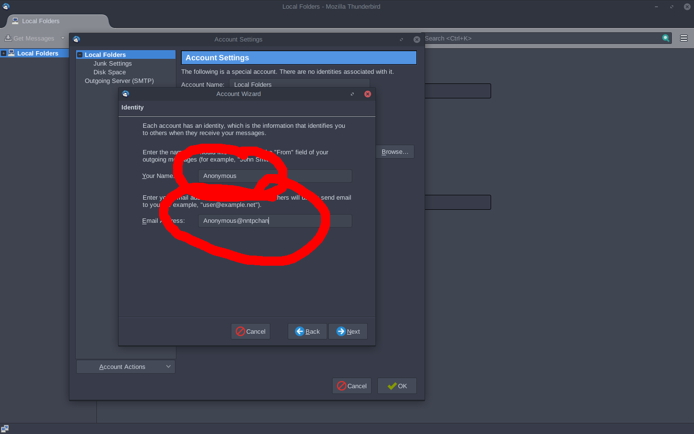

I'm assuming you know your server's IP address

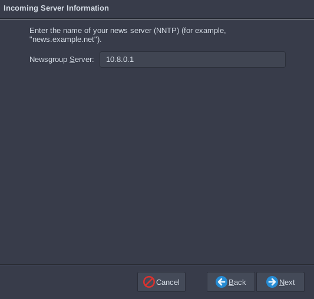

There are still a few things you need to change before it will work. 

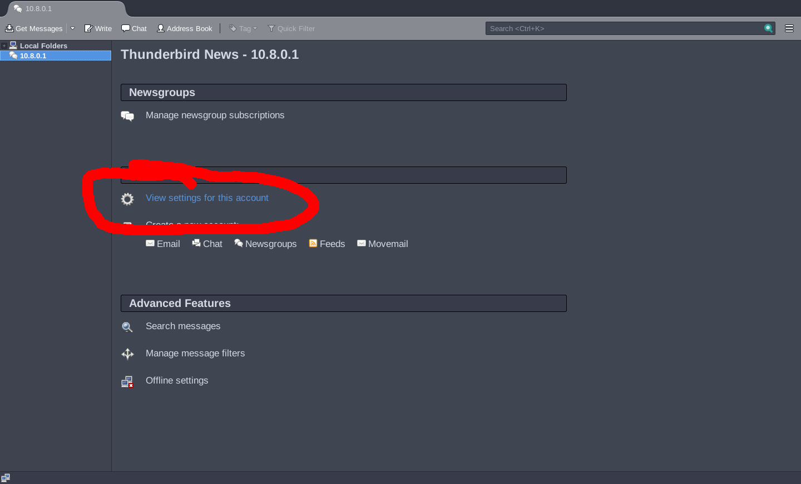

Also, mine didn't work until I set Connection security to None instead of TLS, even though I know for a fact that TLS is enabled in the server. I don't know why.

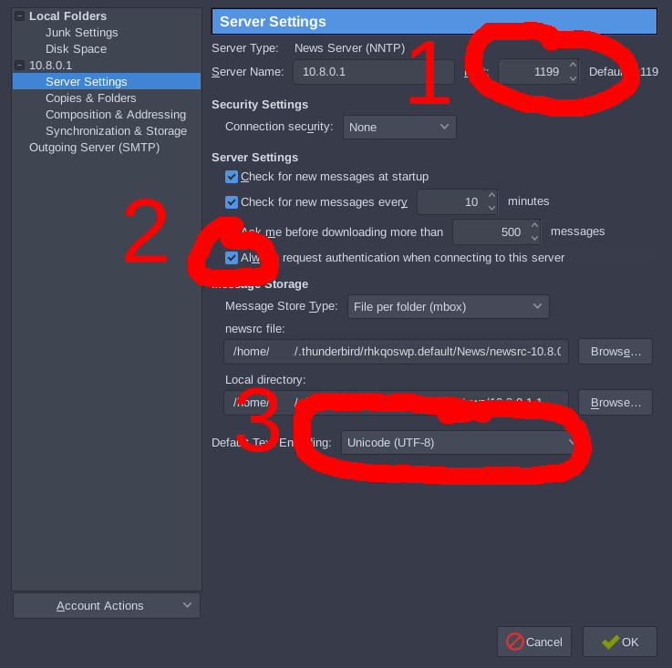

Before you can subscribe to any groups you need to log in

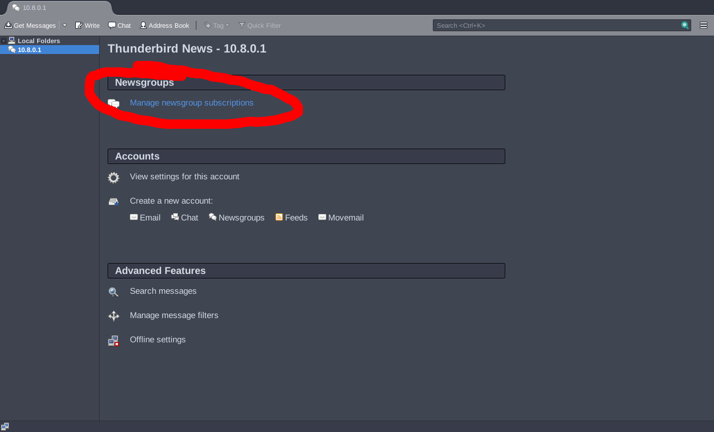

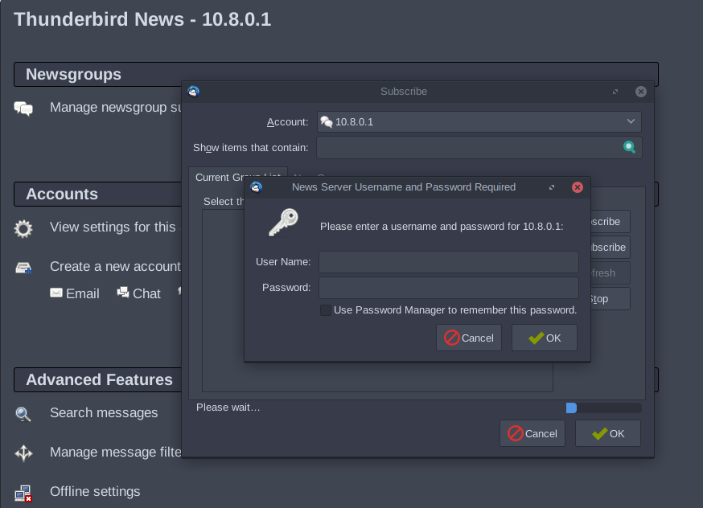

Add your account on the server

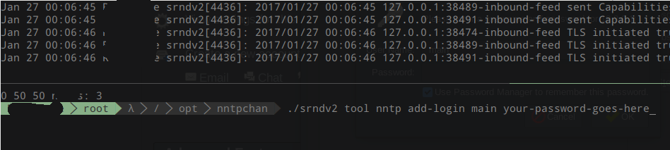

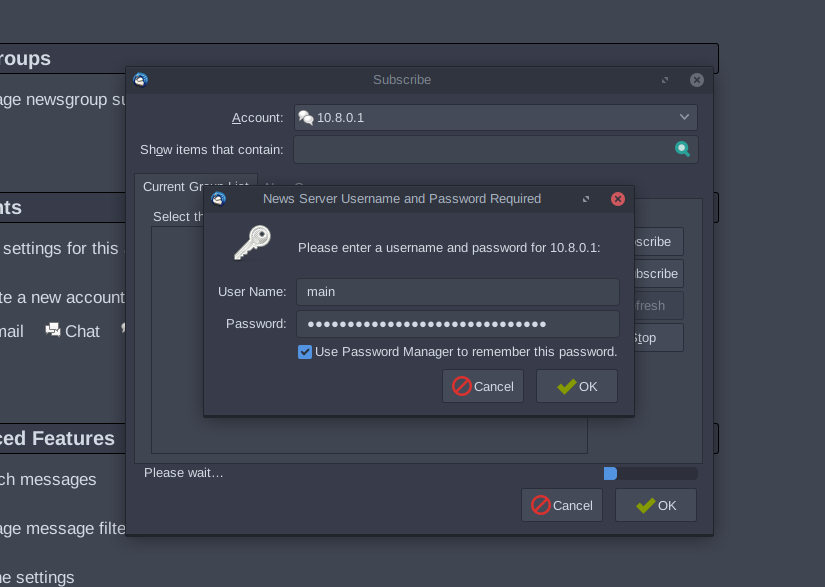

Now you can subscribe to groups

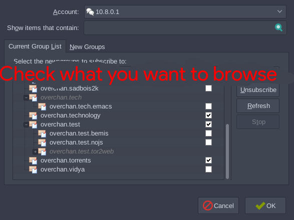

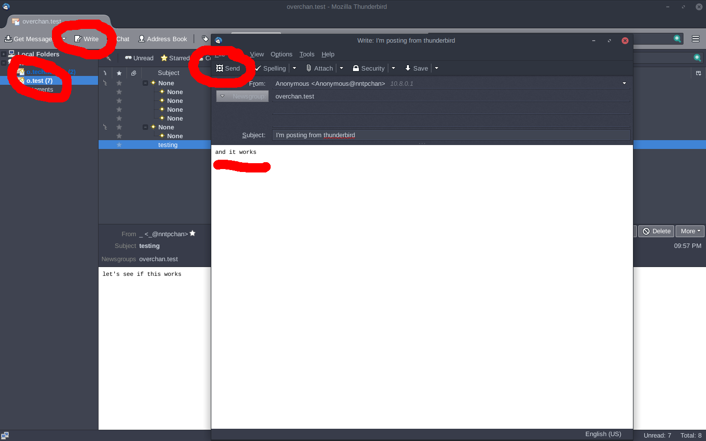
