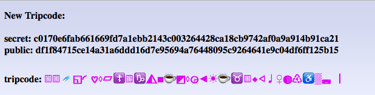
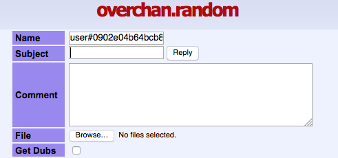

Moderating NNTPChan
================

Once you have done [the initial setup you](setting-up.md) you can grant users mod privileges.

### Generate TripCode

Navigate to http://[yourNodeURL]/mod/keygen (e.g. http://oniichanylo2tsi4.onion/mod/keygen) and save both your secret an public key.

E.g.

### Use TripCode

If you want to be uniquely identified when posting on NNTPChan you can 'authenticate' yourself by putting in the name field name#yourprivatekey

E.g.

    user#0902e04b64bcb8172fb1ced455f348c3462fe64ced193247e5df05dc79fe93ee

### Add Moderators

To add a new moderator you need to ask for his public key. Then following [Managing your NNTPChan node with the CLI](cli.md):

Add a public key to moderation trust
Where `publickey` is the public key to be added.

    ./srndv2 tool mod add publickey

Remove a public key from moderation trust
Where `publickey` is the public key to be removed.

    ./srndv2 tool mod del publickey
